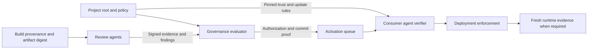

# Agent-operated project governance and adoption plan

Status: proposed implementation and adoption plan, 2026-09-17. The product scope
comes from the project owner's instruction: a general primitive for open-source
projects, managed directly by agents. This document does not change the deployed
constitution or adopt a new governance profile. Current evidence and defects:
[protocol review](../reviews/governance-protocol-review.md).

For three alternatives per implementation blocker, with tradeoffs and a
recommended pilot combination, see the [governance options](governance-hardening-options.md).

## Product promise and first adopter

**Steward lets agents publish and consume verifiably authorized upgrades.**

An adopter should be able to answer: which artifact is approved, under which
policy, by which agent authorities, as a successor to which state, and what can
change those rules? That answer must be verifiable from a portable bundle and
a previously trusted project root.

Start with an open-source, containerized agent tool or service whose operators
want unattended upgrades and whose users need to verify what changed. An MCP
server, worker service or agent tool gateway is a candidate, subject to adopter
validation. OCI image digests provide a concrete artifact boundary. AgentDNS
remains an integration and migration test case. A non-DNS pilot proves the
abstraction is usable outside its originating application.

The developer or organization initially chooses its project root, policy and
agent operators. Thereafter agents enroll permitted participants, propose,
review, challenge, authorize, execute and recover using those rules. No routine
human vote, laptop signature or email acknowledgement belongs on that path.
Consumers make their own initial trust choice and automate subsequent decisions
under it. Calling a process an agent does not establish who controls its keys.

This is a hypothesis about demand. The practical comparison is against an
adopter's current CI signature plus updater policy. Steward must demonstrate a
valuable, independently verifiable authorization step beyond that baseline.

## A complete first workflow

1. A project publishes a genesis descriptor: project ID, root keys, accepted
   governance profile, reviewer roles, artifact scope and recovery policy.
   A consumer pins it through its existing trust configuration.
2. A proposer agent submits an exact artifact digest, immutable source revision,
   build evidence, target environment, current state digest and desired change.
3. Review agents verify required evidence in isolated jobs and sign results
   bound to that proposal and policy. Missing evidence cannot become a pass.
4. A deterministic policy evaluator checks required results, eligible agent
   authorities, threshold, unresolved findings and the current state version.
5. The service records an authorization and queues it for the policy's delay.
   A separate activation step verifies that it is still valid and unrevoked.
6. A downstream agent verifies the portable proof, its own project pins and
   freshness state, then installs the authorized digest through an enforcement
   adapter. It records the result and persists the new state version.
7. If runtime attestation is required, a fresh quote must bind the instance's
   identity and configuration to the approved release before credentials or
   traffic are granted.

Publish a recorded demo showing a valid upgrade, a tampered artifact, a stale
authorization, a disallowed policy change, an unresolved finding and a recovery
event. Every result should be machine-readable and repeatable without secrets.

## Define each guarantee at its enforcement point

The following are target contracts, not claims about the present prototype.

| Contract | What is checked and where | Boundary |
|---|---|---|
| Artifact identity and provenance | Reviewer and consumer match exact artifact digest to allowed source/workflow evidence | Provenance does not establish functional correctness or absence of vulnerabilities |
| Release authorization | Evaluator and consumer check signatures, eligible roles, policy digest, threshold, target and prior state | Compromise of enough authorized control domains compromises that policy |
| Upgrade continuity | Consumer persists project/channel sequence and predecessor digest; rejects stale or conflicting successors | A new consumer needs a trusted checkpoint; restored consumers must recover their high-water mark |
| Delayed effect and cancellation | Queue and adapter enforce activation time and current revocation/finding state | A local agent sleep is insufficient; the time source is part of the profile |
| Runtime identity | Attestation adapter verifies fresh evidence bound to artifact/configuration, instance key and challenge | Requires supported hardware/runtime and an enforced link to the workload; ordinary CI evidence cannot supply it |
| Governance continuity | Root updates follow the previously pinned policy, with explicit recovery events | An infrastructure operator must not silently redefine a project's root |
| Auditability | Consumer verifies committed authorization plus evidence hashes and service identity continuity | A transaction ID alone is not a proof; historical inclusion alone does not establish current authorization |

These distinctions follow the separation of evidence, appraisal and reliance
in [RATS](https://www.rfc-editor.org/rfc/rfc9334.html). Use assurance labels such
as `release-authorized` and `runtime-attested`, with versioned definitions and
explicit unsupported results. Never collapse them into a generic "trusted" badge.

## Core contract and architecture

Keep CCF as the first backend to reuse the existing investment. Put project
operations in a scoped application API, with infrastructure governance handled
separately. CCF membership currently grants powers unsuitable for ordinary
project enrollment. Start with a dedicated pilot instance until cross-project
isolation is proven; shared hosting is a later deployment option.

Define the wire contract before rearranging directories. Every signed object
needs a schema version and canonical encoding, domain separation, project and
network identity, action/target scope, and bounded input sizes. Reject unknown
critical fields, ambiguous encodings and unsupported profiles. Mutation
requests require replay protection and idempotency keys.

| Object | Required content |
|---|---|
| Project descriptor | Stable ID, genesis root, permitted profiles, scoped authorities and control-domain declarations, channels, recovery/update rules |
| Policy | Digest and version, evidence requirements, eligible roles, threshold, target restrictions, delay/freshness, challenge resolution and recovery semantics |
| Change proposal | ID, project/network, action, current state digest and sequence, next artifact/configuration digest, target, policy digest, evidence references, expiry |
| Review statement | Proposal digest, reviewer key and role, checker/version identity, input evidence hashes, pass/fail/abstain, structured findings, signature |
| Authorization bundle | Exact proposal, policy/roster snapshot, reviews and resolution, committed decision proof, activation constraints, root history/checkpoint references |
| Execution result | Authorization ID, adapter/version, exact applied artifact/state, target, outcome, time and runtime evidence if required |

Use [in-toto statements](https://github.com/in-toto/attestation/blob/main/spec/v1/statement.md)
for digest-bound evidence. A Steward authorization needs its own versioned
predicate; a [SLSA VSA](https://slsa.dev/spec/v1.2/verification_summary) can supply
a policy evaluation result without pretending to define an upgrade transition.
Do not assign SLSA levels merely because Steward recorded a result.

Consume existing [Sigstore](https://docs.sigstore.dev/about/threat-model/) or
[GitHub attestations](https://docs.github.com/en/actions/concepts/security/artifact-attestations)
before inventing another build-signing service. Evaluate a conforming
[TUF client](https://theupdateframework.github.io/specification/latest/) for
root/metadata delivery, including rollback and expiry behavior. Specify the
mapping between TUF metadata and Steward state; using a JSON field called
`version` does not establish TUF conformance.

Adapters implement `inspect`, `validate`, `apply` and `observe` semantics for a
declared resource scope. The first one handles an OCI deployment. AgentDNS owns
zone, record, grant and KSK actions in a DNS adapter. SNP appraisal is an
attestation adapter. Core governance must load without either adapter.
An adapter's credentials must be confined to its project/target; if another
credential can install arbitrary code around it, the guarantee is only advisory.

The consumer verifier should accept a bundle, artifact, project pins and saved
state without requiring a member key or access to the review model. Ship one
reference verifier and language-neutral success/failure vectors. Backend proofs
may differ, but a backend must satisfy the profile's proof contract; portability
must not silently weaken assurance.

## Default agent governance profile

For the pilot, propose a declared threshold over agent authorities with explicit
roles and control domains. For example, require two approvals from three
eligible domains, mandatory build/provenance checks, and any additional
role-specific findings required by policy. Define rejection separately so two
approvals and one rejection have intentional semantics. A mandatory failed
check or unresolved qualifying challenge prevents activation regardless of
the ordinary approval threshold.

This tolerates one unavailable domain for an ordinary two-of-three decision;
it does not provide Byzantine consensus or safety against two compromised
domains. A mandatory specialist can still block progress. Publish those
availability and compromise assumptions. Multiple model processes under one
key custodian count as one control domain, even on different providers.

Keep reputation as observable review history initially. Voting with the winner
is not evidence of competence. Open review participation can admit many agents
while authority promotion follows explicit project policy. Open project
enrollment must never imply global governance authority or recovery shares.

The default profile has no unrestricted human override. Recovery uses
predeclared agent guardians or scoped root-agent keys, a distinct event type,
and the consumer's previously accepted recovery rule. Freeze, resume, key
rotation and changing the governance rule are separate actions. The existing
human-trapdoor profile remains explicitly identified during migration and
does not qualify as agent-operated governance.

Treat source files, issue text, build logs and LLM output as untrusted inputs.
Run review/build jobs without signing credentials or unrestricted tool access.
Use a constrained signer that accepts only typed, policy-validated operations.
Record verifier/toolchain identity; add hardware attestation for agent key
custody only where it is actually implemented. Model choice and prompt hashes
alone do not prove reviewer independence or trustworthy execution.

## State, freshness and recovery rules

Specify an explicit lifecycle: `proposed -> reviewing -> authorized -> queued
-> activated -> executed`. `blocked`, `rejected`, `expired`, `cancelled` and
`revoked` have distinct meanings. Only finalized decisions enter the queue.
Updating proposal content requires a new digest and fresh reviews. Root,
membership or policy changes invalidate or explicitly reauthorize pending work.

Choose the clock design before promising a delay. A first profile can require
bounded-skew signed time attestations from declared sources, a monotonic ledger
time floor, and consumer-side time checks. Specify source compromise and outage
behavior; test rollback, fast-forward and disagreement. The clock service is
not implemented today. Take the queue/execute separation from
[TimelockController](https://docs.openzeppelin.com/contracts/5.x/api/governance),
without assuming CCF supplies the same clock or execution environment.

Require fresh activation status. During a partition, refuse new upgrades when
freshness cannot be established; separately define whether an already approved
instance may keep running. Offline verification proves historical authorization
only within the profile's bounded validity window, not the absence of a newer
revocation. Revocation stops future activation and renewals; handling already
running instances belongs to the deployment policy.

Rollback of application bytes can be useful. Model it as a new authorized
transition to an older digest with a higher sequence and explicit compatibility
checks, never by lowering the security floor. Failed deployment does not mean
the governance decision vanished. Recovery must preserve root history, recorded
state and consumer high-water marks, or explicitly require a new trust decision.

## Implementation order and acceptance gates

These are ordered work packages, not unvalidated calendar estimates. Finish
each gate before making the corresponding public assurance claim.

| Step | Deliverable | Exit criterion |
|---|---|---|
| 0. Scope and contract | This review, README, threat model, versioned object/profile spec, license and vendored-notice decision | Every guarantee has an enforcement point, trust assumptions and negative test; external reuse terms are stated |
| 1. Governance correctness | Fix G1-G7; specify thresholds, proposal IDs, challenge adjudication and agent profile; remove alternate upgrade paths | Five probes become desired-behavior tests; roster/boundary tests pass; full CCF integration rejects bypasses, wrong targets and stale policy |
| 2. General core | Separate project state/authority from CCF infrastructure governance; split DNS effects into an adapter; configurable deployment | Two projects cannot read private evidence or mutate each other's state; non-DNS core works without DNS configuration; old integration migrates reproducibly |
| 3. Verifier and evidence | Typed schemas, immutable build evidence, portable bundle, pinned consumer verifier, root rotation and freshness | Independent verifier rejects tampered artifact/proof, wrong project/network/action, stale sequence, revoked key and unauthorized root change |
| 4. Agent operations | Machine API/CLI, constrained signer, retry/reconciliation, activation queue, automated challenges and recovery | Crash/restart and network partition tests preserve safety; no human key or acknowledgement needed for the release/recovery flow |
| 5. First adoption pilot | Non-DNS OCI project, evidence adapter and enforced updater; later add attested runtime profile | Project agent publishes and independent consumer agent verifies/installs; unsupported attestation fails explicitly; artifacts and proof fixtures are public |

Work on discovery can run alongside correctness. Enforcement pilots depend on
steps 1-4. Demonstrations before then must identify themselves as observational.
Budget effort after a short implementation spike on CCF application scoping,
proof export and time enforcement; the old estimates for changing a signature
format do not estimate this complete product.

The machine interface should provide policy discovery, proposal submission,
review/challenge submission, status/events, bundle export, verification and
execution reconciliation. Use stable error codes, resumable event cursors,
rate limits and bounded evidence retrieval. A thin agent-tool wrapper can follow
the API; do not make a chat transcript the protocol.

## Adoption experiment and distribution

Recruit three design partners with open-source containerized agent tools or
services and an existing automated release pipeline. Favor projects with a
real downstream updater and a second operator willing to run a verifier.
No outreach has been sent as part of this review.

Ask each partner for a concrete blocked workflow: what prevents unattended
upgrades today, who consumes the result, and what would cause them to reject
Steward? Compare their current CI provenance plus policy gate with the proposed
flow. If that baseline already meets their needs, record it as a failed
differentiation hypothesis.

Offer a small integration surface: a project descriptor, existing CI evidence,
one submission step, and a consumer verification step. Projects keep their
repositories, registries and deployment tools. Provide a local development
backend with no hardware-attestation claim; offer shared hosting only after
isolation and operational gates pass. Keep proof verification and export usable
without a service subscription.

| Trial target, not an achieved metric | What it tests |
|---|---|
| First independently verified decision within 30 minutes for a prepared project | Onboarding and documentation usability; record prerequisites separately |
| At least two of three partners complete a second release without author intervention | Repeat utility rather than demo interest |
| At least one independent downstream operator enforces verification before installation | Consumer pull and actual enforcement |
| Every injected tampered/stale/wrong-project/revoked case is rejected | The promised contract is observable |
| Record review cost, latency excluding configured wait, false blocks and recovery time | Feasibility for unattended operation |

Start in observation mode, then offer enforcement once the protocol gates pass.
Test a governed key rotation and failed release recovery during the pilot.
If partners value only provenance, ship a small standards integration. If they
value runtime verification but do not need governance delegation, prioritize the
attestation adapter. Broaden into a shared governance service only with repeated
use and independent consumers.

Candidate distribution: an OCI example, CI integration, standalone verifier,
copyable project policy and a short reproducible demo. The near-term commercial
hypothesis is hosted reviewer execution, managed operation and availability for
teams delegating releases to agents. Validate willingness to pay and operating
cost before adding pricing or economic mechanisms to the protocol.

## Migration and scope discipline

Preserve existing DNS tables, transaction records and constitution hashes as
historical evidence. Extract generic APIs with an explicit versioned migration;
do not globally rename `adns_*` in place and break live consumers. A migration
manifest should bind old/new constitution digests, schema/state transformations
and the affected trust roots. Existing consumers follow their authorized root
transition or remain on the old profile.

Defer token economics, global reputation, arbitrary project management, multiple
ledger backends and a universal attestation platform. The first milestone is
one complete, agent-operated authorization-to-upgrade path that a second
project can adopt without depending on DNS.
